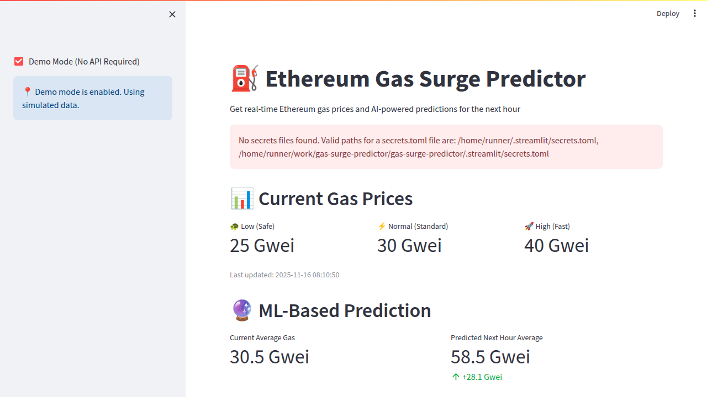
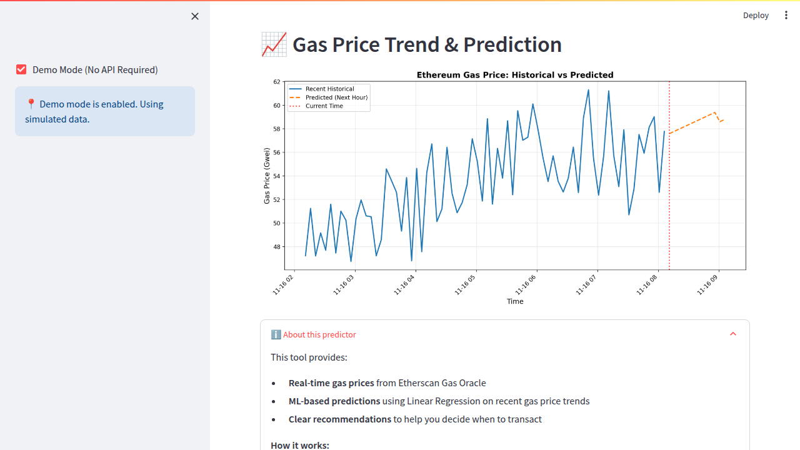

# gas-surge-predictor# 

⛽ Ethereum Gas Surge Predictor

A mini web app that shows current Ethereum gas prices and uses machine learning to predict gas prices for the next hour, helping you decide the best time to send transactions.

## Features

- 📊 **Real-time Gas Prices**: Displays current Ethereum gas prices (Low/Normal/High) from Etherscan Gas Oracle
- 🔮 **ML-Powered Predictions**: Uses Linear Regression on recent gas history to predict average gas for the next hour
- 💡 **Clear Recommendations**: 
  - ✅ "Send now" - when prices are stable or predicted to increase
  - ⚠️ "Might want to wait" - when prices are predicted to decrease significantly
- 📈 **Visual Chart**: Interactive plot showing recent gas prices vs predicted prices
- 🔄 **Auto-refresh**: Optional automatic updates every 60 seconds

## Tech Stack

- **Python**: requests, pandas, scikit-learn, streamlit, matplotlib
- **Data Source**: Etherscan Gas Oracle API
- **ML Model**: Linear Regression for time-series prediction

## Installation

1. Clone the repository

2. Install dependencies:
```bash
pip install -r requirements.txt
```

3. (Optional) Set up Etherscan API key:
   - Get a free API key from [Etherscan](https://etherscan.io/apis)
   - Create a `.streamlit/secrets.toml` file:
   ```toml
   ETHERSCAN_API_KEY = "your_api_key_here"
   ```
   - Note: The app will work without an API key but may have rate limits

## Usage

Run the Streamlit app:
```bash
streamlit run app.py
```

The app will open in your browser at `http://localhost:8501`

## How It Works

1. **Fetch Current Prices**: Retrieves real-time gas prices from Etherscan Gas Oracle API
2. **Generate Historical Data**: Creates synthetic historical data based on realistic patterns (for demonstration)
3. **Train ML Model**: Uses Linear Regression on recent 6-hour gas price trends
4. **Predict Future**: Forecasts average gas price for the next hour (12 data points at 5-minute intervals)
5. **Provide Recommendation**: Compares current vs predicted prices to suggest action

## Recommendation Logic

- **⚠️ Might want to wait**: Predicted gas price increase > 10%
- **✅ Send now**: Predicted gas price decrease > 5% OR relatively stable (±10%)

## Screenshots

#### Main Interface


#### Chart & Prediction


## Future Enhancements

- Integrate real-time historical gas price data feed
- Add more sophisticated ML models (LSTM, ARIMA)
- Support for multiple networks (Polygon, BSC, etc.)
- Price alerts and notifications
- Historical accuracy tracking

## Contributing

Contributions are welcome! Please feel free to submit a Pull Request.

## License

MIT License

## Disclaimer

This tool is for educational and informational purposes only. Gas price predictions are based on historical patterns and may not reflect actual future prices. Always verify current gas prices before making transactions.